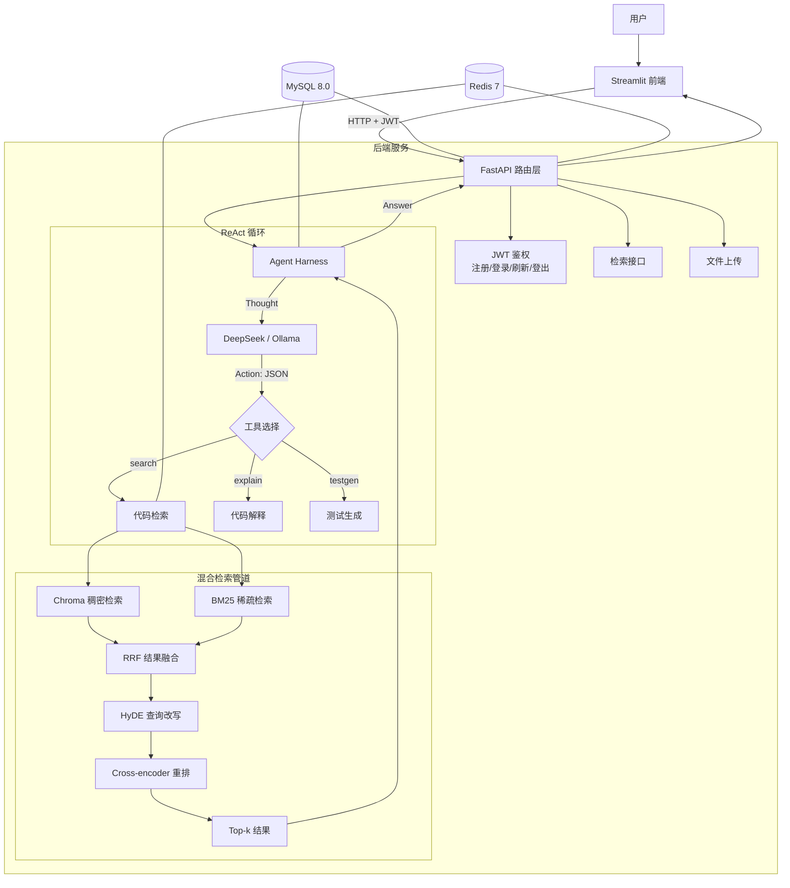

# Code Assistant Agent

一个基于 RAG 的代码问答与 Agent 系统，以 TinyDB 开源项目为知识库，提供代码检索、AI 问答、单元测试生成能力。

## 项目亮点

- **混合检索 RAG 管道**：稠密向量检索（Chroma + all-MiniLM-L6-v2）+ BM25 稀疏检索 + RRF 结果融合 + HyDE 查询改写 + cross-encoder 重排
- **轻量 Agent Harness**：自研 ReAct 循环（Thought-Action-Observation），真实 LLM 决策，无需 LangGraph，代码全可控
- **三个 Agent 工具**：search（混合检索）、explain（代码解释）、testgen（测试生成）
- **完整评估体系**：20 条测试集 + Hit Rate / MRR / NDCG 指标 + 5 组消融实验
- **数据隔离**：用户会话、上传文件按 owner_id 隔离，系统语料与用户语料在检索端分离
- **工程化完备**：JWT 鉴权 + Redis 黑名单登出、ZSET 滑动窗口限流、MySQL 会话持久化、Docker 一键部署、GitHub Actions CI（含鉴权集成测试）

## 架构



## 技术栈

| 层 | 技术 | 关键点 |
|----|------|--------|
| 后端框架 | FastAPI (异步) | asyncio 并发、依赖注入、中间件 |
| ORM / 数据库 | SQLAlchemy 2.0 + aiomysql、MySQL 8.0 | 异步会话、模型迁移 |
| 缓存 | Redis 7 | 检索缓存、滑动窗口限流、token 黑名单 |
| 向量库 | Chroma | 本地嵌入、持久化 |
| Embedding | sentence-transformers/all-MiniLM-L6-v2 | 稠密检索向量化 |
| **检索策略** | **混合检索** | **Dense（Chroma）+ Sparse（BM25）双路召回** |
| **结果融合** | **RRF（Reciprocal Rank Fusion）** | **1/(k+rank) 无权重融合，融合两路排名** |
| **查询改写** | **HyDE** | **LLM 生成假设文档后再检索，提升召回** |
| **重排序** | **cross-encoder（ms-marco）** | **对初检 top-10 精排 top-3** |
| **Agent 模式** | **ReAct（Thought-Action-Observation）** | **真实 LLM 自主决策，非 if-else** |
| **工具调用** | **search / explain / testgen** | **工具描述注入 prompt，LLM 选工具执行** |
| LLM | DeepSeek API（生产）/ Ollama（本地开发） | 可切换 |
| 前端 | Streamlit | 对话 / 检索 / 上传三 Tab |
| 部署 | Docker Compose、GitHub Actions | 一键启动 + CI |

## 快速开始

### 方式一：Docker Compose（推荐）

```bash
# 1. 准备环境变量
cp .env.example .env
# 编辑 .env，填入 LLM_API_KEY（DeepSeek）等配置

# 2. 一键启动（MySQL + Redis + 后端 + 前端）
docker compose up --build

# 3. 访问
# 前端: http://localhost:8501
# API 文档: http://localhost:8000/docs
```

### 方式二：本地开发

```bash
# 1. 启动 MySQL 和 Redis
docker compose up mysql redis

# 2. 安装后端依赖
cd backend
pip install -r requirements.txt

# 3. 构建索引（首次需要）
python -m app.rag.code_indexer

# 4. 启动后端
uvicorn app.main:app --reload

# 5. 启动前端
cd ../frontend
streamlit run streamlit_app.py
```

## 核心模块

### RAG 层（backend/app/rag/）

| 模块 | 职责 |
|------|------|
| `chunker.py` | 多策略分块（recursive / token / semantic），可配置切换 |
| `dense_retriever.py` | Chroma 稠密检索，带 Redis 结果缓存 |
| `sparse_retriever.py` | BM25 稀疏检索，索引可缓存到 Redis 恢复 |
| `fusion.py` | RRF 融合 + 混合检索编排 + 检索链路打点 |
| `query_rewriter.py` | HyDE 查询改写，改写记录落库 |
| `reranker.py` | cross-encoder 重排序，带 Redis 缓存 |
| `evaluation.py` | Hit Rate / MRR / NDCG 指标 + 消融实验框架 |
| `test_set.py` | 20 条中文测试集（问题 + 期望源文件） |

### Agent 层（backend/app/agent/）

| 模块 | 职责 |
|------|------|
| `harness.py` | ReAct 循环引擎，工具调度，决策日志落库 |
| `tools.py` | 三个工具：search / explain / testgen |
| `prompt.py` | ReAct 系统提示词（工具描述动态注入） |
| `llm.py` | LLM 调用封装（DeepSeek / Ollama 可切换） |

### API 层（backend/app/routers/）

| 模块 | 职责 |
|------|------|
| `auth_router.py` | 注册 / 登录 / 刷新 / 登出（Redis 黑名单） |
| `agent_router.py` | Agent 对话接口，MySQL 会话持久化 |
| `search_router.py` | 代码检索接口（hybrid / HyDE / rerank 可选） |
| `upload_router.py` | 文件上传 + 索引 |

### 基础设施

| 模块 | 职责 |
|------|------|
| `models/` | ORM 模型（users / conversations / agent_logs / retrieval_logs 等） |
| `auth.py` | JWT 签发验证 + bcrypt 密码哈希 |
| `middleware.py` | Redis 滑动窗口限流 |
| `services/` | 业务服务层（会话历史保存与恢复） |
## 评估数据

基于 20 条测试集的消融实验（Hit Rate / MRR / NDCG）：

| 配置 | Hit Rate | MRR | NDCG | 延迟(ms) |
|------|----------|-----|------|----------|
| dense_only | 0.80 | 0.70 | 0.69 | 13 |
| sparse_only | 0.80 | 0.70 | 0.69 | 0.3 |
| hybrid_baseline | 0.80 | 0.70 | 0.69 | 0.2 |
| hybrid + HyDE | 0.85 | 0.72 | 0.72 | 7600 |
| hybrid + HyDE + rerank | 0.75 | 0.59 | 0.57 | 9000 |

**结论**：HyDE 查询改写显著提升召回率；reranker 在代码场景下降（模型在网页搜索领域训练）；hybrid 融合在接近零延迟下持平单路。

## API 概览

| 方法 | 路径 | 说明 |
|------|------|------|
| POST | /api/auth/register | 注册 |
| POST | /api/auth/login | 登录 |
| POST | /api/auth/refresh | 刷新 token |
| POST | /api/auth/logout | 登出（Redis 黑名单） |
| POST | /api/agent/chat | Agent 对话 |
| POST | /api/search | 代码检索 |
| POST | /api/upload | 上传文件并索引 |

## CI/CD

GitHub Actions 自动运行单元测试（密码哈希），push 到 main 触发。

## License

MIT