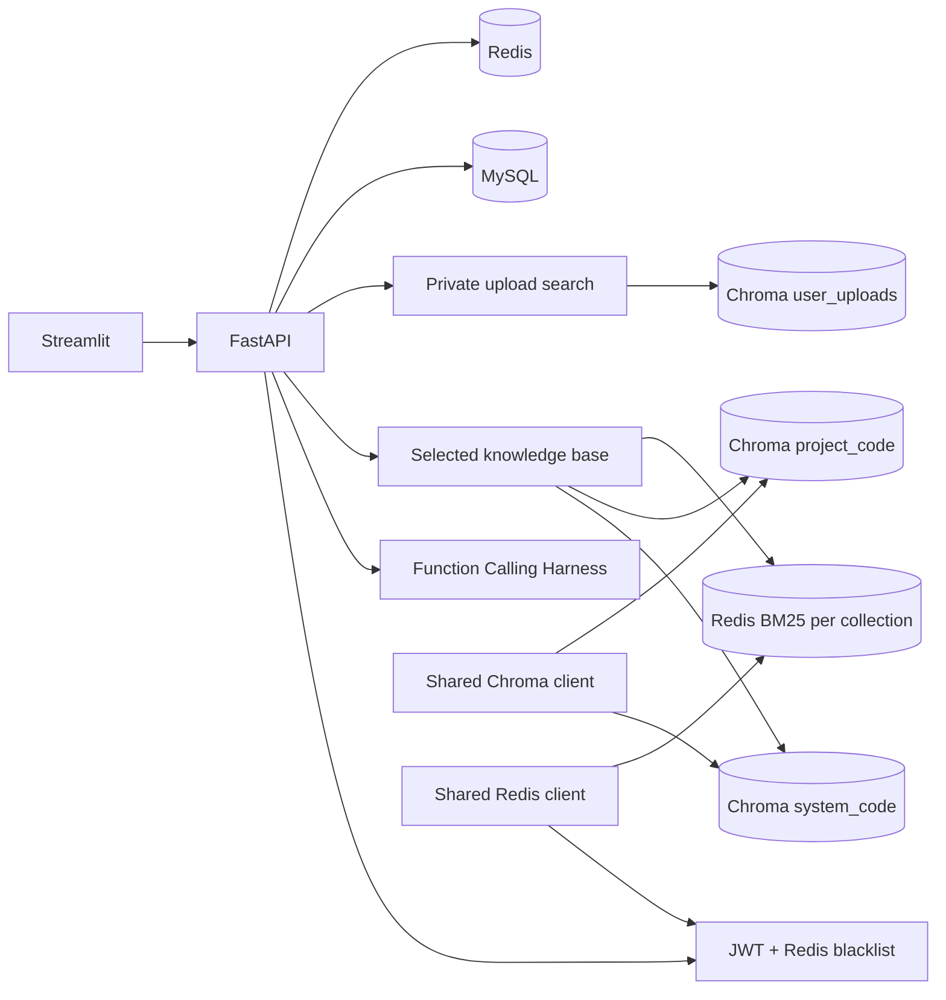

# Code Assistant Agent

面向 TinyDB 开源代码库和本项目源码的 RAG 代码问答系统。项目关注可运行的检索、Function Calling Agent、多用户数据边界和评估链路，而不将其包装为生产系统。

## 已实现能力

- **双公开知识库**：TinyDB 与当前项目源码使用独立的 Chroma collection、BM25 Redis key 和检索范围；前端、搜索 API 与 Agent 都可显式选择知识库。
- **混合检索 RAG**：支持 Recursive / Token / Semantic 分块、Chroma Dense 召回、BM25 稀疏召回、RRF 融合；HyDE 查询改写与 cross-encoder 重排可选。
- **Function Calling Agent**：`search`、`explain`、`testgen` 三个白名单工具由 Pydantic 生成 JSON Schema。工具参数在服务端校验，未知工具、非法参数和同轮重复调用都会被拒绝。
- **可观测性与引用**：响应返回工具名称、已校验参数、执行状态、截断后的 Observation 和来源代码引用；前端可在已登录状态下点击引用查看对应的完整 `.py` 源文件，不展示或持久化模型原始思维链。
- **安全与隔离**：JWT 鉴权、Redis 黑名单登出、ZSET 滑动窗口限流；会话按用户和知识库隔离，用户上传按 `owner_id` 在 Chroma 检索端过滤。
- **性能可见性**：对话响应包含服务端端到端耗时、Agent 耗时、协调模型耗时、工具耗时和工具调用次数；流式对话额外记录服务端首 token 时间。Chroma 持久化客户端与 Redis 连接在进程内复用。
- **工程化**：Docker Compose、GitHub Actions、鉴权和核心检索契约测试；前端对登录、检索、上传、流式对话和引用查看的网络/服务端失败均有明确失败态。

## 架构



## 知识库边界

| ID | 内容 | Chroma collection | BM25 Redis key |
| --- | --- | --- | --- |
| `tinydb` | TinyDB 开源代码 | `system_code` | 按 `system_code` 和分块策略命名 |
| `project` | 当前 Code Assistant Agent 源码 | `project_code` | 按 `project_code` 和分块策略命名 |
| 用户上传 | 当前用户的私有文本/代码 | `user_uploads` | 不进入 BM25 和 Agent 主检索 |

项目源码知识库只索引 `.py` 文件，并跳过 `tests`、`env/.venv`、`data`、`.git`、`__pycache__` 等目录。公开库切换时，Agent 工具在初始化阶段绑定到所选知识库；对话持久化键使用 `knowledge_base:session_id`，避免历史串库。源码查看接口同样只允许读取所选知识库根目录内、未被排除的 `.py` 文件，拒绝绝对路径和目录穿越。

## 索引生命周期

执行 `python -m app.rag.code_indexer` 会依次重建两个公开知识库，并打印每个知识库的状态：

- `ready`：完成分块、Dense 写入和 BM25 构建，返回文件数、chunk 数和构建耗时。
- `skipped`：没有可索引的源码或分块为空，保留原有索引。
- `busy`：同一后端进程中已有索引任务在执行。
- `failed`：返回失败原因；Dense collection 替换失败时尝试恢复原 collection 内容。

重建在单进程内串行执行，避免两个重建任务同时替换同一 collection。它不是跨 Chroma 与 Redis 的分布式事务；需要高可用或多实例部署时，仍应引入版本化 collection、健康检查和显式切换流程。

## 本地运行

前置条件：Python 3.11、MySQL 8、Redis 7，以及本地可加载的 `sentence-transformers/all-MiniLM-L6-v2` 模型。

```powershell
Copy-Item .env.example .env
# 在 .env 中填写 LLM_API_KEY 与至少 32 字符的 JWT_SECRET

docker compose up mysql redis

cd backend
python -m pip install -r requirements.txt

# 同时构建 TinyDB 和项目源码两个公开知识库
python -m app.rag.code_indexer

uvicorn app.main:app --reload
```

新开终端启动前端：

```powershell
cd frontend
streamlit run streamlit_app.py
```

也可用 Docker Compose 启动：

```powershell
docker compose up --build
docker compose exec backend python -m app.rag.code_indexer
```

Compose 会将项目根目录以只读方式挂载到后端容器，供 `project` 知识库索引；不会把源码写回挂载目录。

## API 概览

| 方法 | 路径 | 说明 |
| --- | --- | --- |
| POST | `/api/auth/register` | 注册并返回 token |
| POST | `/api/auth/login` | 登录 |
| POST | `/api/auth/logout` | 将 access token 加入 Redis 黑名单 |
| POST | `/api/search` | 检索指定 `knowledge_base` 的公开代码库 |
| GET | `/api/search/source` | 查看指定公开知识库内被引用的 `.py` 源文件，需要 JWT |
| POST | `/api/agent/chat` | 在指定 `knowledge_base` 内执行 Agent 对话 |
| POST | `/api/agent/chat/stream` | 以 SSE 流式返回 Agent 状态、轨迹、文本、引用和性能指标 |
| POST | `/api/upload` | 上传并索引当前用户的私有文件 |
| POST | `/api/upload/search` | 仅检索当前用户上传的内容 |

公开代码检索请求示例：

```json
{
  "query": "Function Calling 的工具参数如何校验？",
  "knowledge_base": "project",
  "top_k": 5,
  "use_hybrid": true
}
```

### 对话响应与性能指标

普通对话接口会在 `metrics` 字段返回本次服务端请求的耗时拆分；流式接口会在 SSE 的 `done` 事件中返回同一结构，并在有文本输出时包含 `time_to_first_token_ms`。

```json
{
  "server_e2e_latency_ms": 1280.5,
  "agent_latency_ms": 1210.3,
  "coordinator_llm_latency_ms": 820.1,
  "tool_latency_ms": 360.4,
  "coordinator_llm_call_count": 2,
  "tool_call_count": 1,
  "time_to_first_token_ms": 980.2
}
```

这些指标是单次服务端请求的观测值，用于定位慢点和比较改动前后，不是压测结果、P95/P99 或生产 SLA。

## 评估

### 检索回归与消融

`backend/app/rag/test_set.py` 中有 20 条中文检索题，标注预期命中的源文件，用于 Hit Rate、MRR、NDCG@5 回归。评估与生产路径一样从 Redis 恢复对应 collection 的 BM25 索引；索引缺失会直接失败，不会把空 BM25 当作有效结果。

```powershell
cd backend
python -c "import asyncio; from app.rag.evaluation import run_ablation; asyncio.run(run_ablation())"
```

最新一轮 TinyDB 测试集结果如下。它只反映当前 20 条题、当前索引与当前环境，不能外推为通用能力或生产 SLA。

| 配置 | Hit Rate | MRR | NDCG | 平均检索路径耗时(ms) |
| --- | ---: | ---: | ---: | ---: |
| dense_only | 0.95 | 0.60 | 0.60 | 12.87 |
| sparse_only | 0.70 | 0.45 | 0.44 | 0.05 |
| hybrid_baseline | 1.00 | 0.59 | 0.58 | 0.89 |
| hybrid + HyDE | 1.00 | 0.59 | 0.58 | 3607.83 |
| hybrid + HyDE + rerank | 0.85 | 0.49 | 0.48 | 3720.40 |

结论：混合召回提升了该测试集的 Hit Rate；HyDE 在该数据集没有带来增益且显著增加 LLM 延迟；当前 cross-encoder 对代码检索表现不佳，因此二者默认不应视为必选组件。

### 可选 RAGAS 评估

`backend/scripts/eval_ragas.py` 可通过 `--knowledge-base tinydb/project` 评估指定公开知识库。它复用对应 collection 的 Dense + BM25 + RRF 获取 contexts，让业务 LLM 基于 contexts 生成 answer，再使用独立配置的 LLM Judge 计算：

- `context_precision`：检索上下文对问题的相关性。
- `answer_correctness`：答案与参考答案的一致性。

```powershell
cd backend
python -m pip install -r requirements-eval.txt
python -m scripts.eval_ragas.py --knowledge-base project
```

TinyDB 使用 `backend/app/agent/eval_tasks.py` 中的 8 条人工题。项目源码使用 `backend/data/eval/project_eval_set.json` 与 `project_eval_set_extra.json` 中合计 34 条人工审核题，每条包含 `question`、`reference`、`evidence_sources`、分类和难度；两个 JSON 都位于项目索引排除目录，避免参考答案泄漏到 `project_code`。

可通过 `RAGAS_JUDGE_ENDPOINT`、`RAGAS_JUDGE_MODEL`、`RAGAS_JUDGE_API_KEY` 覆盖 Judge 配置。该脚本会产生 LLM 调用成本，不在 CI 中运行；未记录模型、索引版本、运行日期和失败样本前，不应在简历或面试中引用 RAGAS 分数。

自动从源码生成候选题的 Agent 尚未实现。当前项目题集由源码审读生成并绑定证据，作为可复核的人工审核基线；未来即使引入自动生成，也需要校验和人工抽检后冻结测试集，不能让同一模型自动出题、自动定标准并据此宣称泛化能力。

## 测试

```powershell
cd backend
python -m pytest tests -v
```

当前本地回归结果为 `59 passed, 1 skipped`。CI 运行轻量鉴权、Function Calling、轨迹、隔离、限流、融合和 RAGAS 脚本契约测试；不下载 embedding 模型，也不调用付费 Judge。源码引用访问、共享客户端与索引生命周期测试在本地全量回归中覆盖。

## 当前限制

- 本地 embedding 模型需预先缓存或可从模型仓库下载；索引构建本身不下载业务依赖。
- Agent 具有最大步骤数、单轮精确调用去重、总时长与单次 LLM 调用超时，并在流式客户端断开时取消任务；仍没有 token 预算、跨轮语义去重与更系统的回退策略。
- ZSET 限流通过 pipeline 减少往返；高并发下的严格原子配额应改用 Lua 脚本。
- `create_all()` 不是数据库迁移方案；字段变更应引入迁移工具。
- 已记录单请求端到端耗时与阶段耗时，但尚未做并发压测、P95/P99、成本统计或生产 SLA。
